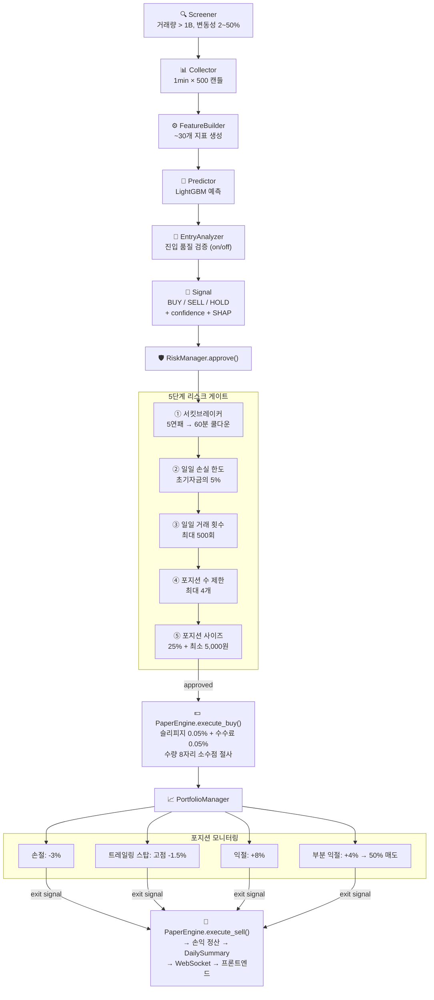

# Crypto Paper Trader

> Upbit 거래소 기반의 ML 자동매매 모의투자 시스템
> LightGBM 분류 모델이 실시간 시장 데이터를 분석하여 매수/매도 시그널을 생성하고, 5단계 리스크 게이트를 통과한 주문만 체결하는 풀스택 트레이딩 플랫폼

<br>

## 📌 Highlights

| | 기능 | 설명 |
|:---:|------|------|
| 👥 | **멀티유저** | 개별 계좌, 개인 리스크 설정, 리더보드 |
| 🔄 | **Hot Reload** | 리스크/전략/스크리닝/진입분석 설정을 재시작 없이 즉시 반영 |
| 💰 | **Decimal 연산** | 모든 금융 계산에 float 대신 Decimal 사용 |
| 📋 | **감사 추적** | 잔고 원장, 거래 이력, 시그널 근거(SHAP) 기록 |
| 🔔 | **실시간 알림** | WebSocket 기반 거래 체결 알림 (토스트 + 알림 패널) |
| 🔍 | **진입 분석기** | Entry Analyzer on/off 토글 (Hot Reload 지원) |
| 🤖 | **AI 어시스턴트** | Google GenAI 기반 종목 분석 채팅 |

<br>

---

<br>

## 🏗️ Architecture

엄격한 **6-Layer 단방향 의존성** 규칙을 따르며, 구조 테스트로 강제합니다.

```
Layer 0  types       도메인 모델 (Candle, Order, Position, Signal ...)
   ↑
Layer 1  config      YAML 설정 로더 (Pydantic 검증)
   ↑
Layer 2  repository  데이터 접근 (SQLite WAL + aiosqlite)
   ↑
Layer 3  service     비즈니스 로직 (ML 학습, 예측, 매매, 리스크)
   ↑
Layer 4  runtime     오케스트레이션 (EventBus, Scheduler, App)
   ↑
Layer 5  ui          FastAPI REST + WebSocket 서버
```

> [!NOTE]
> 상위 레이어는 하위 레이어만 import 가능. 역방향 import 시 `test_layer_deps.py`에서 실패.

<br>

---

<br>

## 🔄 Process Flow

### 1️⃣ 데이터 수집

```
Upbit REST API ──(1min/5min/1D 캔들)──→ Collector ──→ SQLite candles 테이블
Upbit WebSocket ──(실시간 Ticker)──→ UpbitWebSocketService ──→ 메모리 캐시
```

### 2️⃣ ML 학습 파이프라인

| 단계 | 모듈 | 설명 |
|:----:|------|------|
| **Input** | DB candles | 5min 캔들 2,880개 |
| **Feature** | `FeatureBuilder.build()` | ~30개 기술적 지표 (RSI, MACD, Bollinger, EMA, 거래량 비율 등) + 멀티 타임프레임 (3m, 10m, 15m, 60m, 1D) |
| **Train** | `Trainer.train()` | 라벨: 30분 후 수익률 > 0.2% → BUY(1) / LightGBM 500 trees, max_depth=6 / 시계열 분할 (80/20, 셔플 없음) |
| **Save** | `data/models/KRW_{COIN}/` | model + metadata (features, metrics) 저장 |
| **Load** | `Predictor` 캐시 | 1시간 주기 자동 재학습 |

### 3️⃣ 트레이딩 플로우



### 4️⃣ 이벤트 버스

```
NewCandleEvent → ScreenedCoinsEvent → SignalEvent → TradeEvent
     │                  │                  │              │
  캔들 수집          종목 필터링        시그널 발생      주문 체결
```

> 비동기 pub-sub 패턴으로 각 단계가 느슨하게 결합됩니다.

<br>

---

<br>

## 🛠️ Tech Stack

<details>
<summary><b>전체 기술 스택 보기</b></summary>

| 영역 | 기술 | 버전 |
|:----:|------|:----:|
| **Language** | Python | 3.12+ |
| **Web Framework** | FastAPI + Uvicorn | 0.115+ |
| **Database** | SQLite (WAL mode) + aiosqlite | 0.21+ |
| **ML Model** | LightGBM | 4.5+ |
| **ML (보조)** | XGBoost, scikit-learn | 2.1+, 1.6+ |
| **데이터 처리** | pandas, numpy | 2.2+, 2.1+ |
| **기술적 지표** | ta (Technical Analysis) | 0.11+ |
| **모델 직렬화** | joblib | 1.4+ |
| **HTTP 클라이언트** | httpx | 0.28+ |
| **WebSocket** | websockets | 14.0+ |
| **설정** | Pydantic + PyYAML | 2.10+, 6.0+ |
| **인증** | PyJWT + bcrypt | 2.9+, 4.2+ |
| **AI 어시스턴트** | Google GenAI SDK | 1.0+ |
| **Frontend** | React + Vite | - |
| **Lint/Format** | ruff | 0.9+ |
| **Type Check** | mypy (strict) | 1.14+ |
| **Test** | pytest + pytest-asyncio | 8.3+ |

</details>

<br>

---

<br>

## 📁 Project Structure

<details>
<summary><b>디렉토리 구조 보기</b></summary>

```
├── config/
│   └── settings.yaml           # 전체 설정 (리스크, 전략, 스크리닝 등)
├── data/
│   ├── models/                  # 코인별 LightGBM 모델 (KRW_BTC, ...)
│   └── paper_trader.db          # SQLite 데이터베이스
├── src/
│   ├── types/                   # L0: 도메인 모델, Enum, 이벤트
│   ├── config/                  # L1: YAML 설정 로더 (Pydantic)
│   ├── repository/              # L2: DB 접근 (SQLite)
│   │   ├── database.py          #     스키마 초기화, 마이그레이션, WAL
│   │   ├── candle_repo.py       #     캔들 CRUD
│   │   ├── order_repo.py        #     체결 내역
│   │   ├── portfolio_repo.py    #     포지션, 계좌 상태, 리스크 상태
│   │   ├── signal_repo.py       #     시그널 이력 + SHAP 근거
│   │   ├── user_repo.py         #     멀티유저 계정 관리
│   │   ├── user_settings.py     #     유저별 개인 설정
│   │   ├── pending_order_repo.py#     미체결 지정가 주문
│   │   ├── ranking_repo.py      #     리더보드 통계
│   │   └── notification_repo.py #     거래 알림
│   ├── service/                 # L3: 비즈니스 로직
│   │   ├── features.py          #     FeatureBuilder (학습+예측 공용)
│   │   ├── trainer.py           #     LightGBM 학습
│   │   ├── predictor.py         #     모델 예측 + SHAP
│   │   ├── risk_manager.py      #     5단계 리스크 게이트
│   │   ├── paper_engine.py      #     모의 주문 체결
│   │   ├── portfolio.py         #     포지션 관리 + 손익
│   │   ├── screener.py          #     종목 스크리닝
│   │   ├── collector.py         #     Upbit 캔들 수집
│   │   ├── entry_analyzer.py    #     진입 품질 분석 (on/off 토글)
│   │   ├── upbit_client.py      #     Upbit REST API 클라이언트
│   │   └── upbit_ws.py          #     Upbit WebSocket 실시간 티커
│   ├── runtime/                 # L4: 오케스트레이션
│   │   ├── app.py               #     메인 App (생명주기 관리)
│   │   ├── event_bus.py         #     비동기 이벤트 버스
│   │   └── scheduler.py         #     주기적 작업 스케줄러
│   ├── ui/                      # L5: 웹 인터페이스
│   │   ├── api/server.py        #     FastAPI 서버
│   │   ├── api/routes/          #     REST 엔드포인트
│   │   └── frontend/            #     React + Vite 프론트엔드
│   └── main.py                  # 진입점
├── tests/
│   ├── structural/              # 아키텍처 규칙 검증
│   ├── unit/                    # 단위 테스트
│   └── integration/             # 통합 테스트
└── docs/                        # 설계 문서
```

</details>

<br>

---

<br>

## 🌐 API Endpoints

<details>
<summary><b>인증</b></summary>

| Method | 엔드포인트 | 설명 |
|:------:|-----------|------|
| `POST` | `/api/auth/signup` | 회원가입 |
| `POST` | `/api/auth/login` | 로그인 (JWT 발급) |
| `POST` | `/api/auth/refresh` | 토큰 갱신 |

</details>

<details>
<summary><b>대시보드</b></summary>

| Method | 엔드포인트 | 설명 |
|:------:|-----------|------|
| `GET` | `/api/dashboard/notifications` | 알림 목록 |
| `GET` | `/api/dashboard/markets` | 마켓 현황 |
| `GET` | `/api/dashboard/candles` | 캔들 차트 데이터 |
| `GET` | `/api/dashboard/signals` | 시그널 히스토리 |

</details>

<details>
<summary><b>포트폴리오</b></summary>

| Method | 엔드포인트 | 설명 |
|:------:|-----------|------|
| `GET` | `/api/portfolio/summary` | 계좌 요약 (잔고, 평가액) |
| `GET` | `/api/portfolio/positions` | 보유 포지션 |
| `GET` | `/api/portfolio/orders` | 체결 내역 |
| `GET` | `/api/portfolio/daily` | 일별 수익 요약 |

</details>

<details>
<summary><b>전략</b></summary>

| Method | 엔드포인트 | 설명 |
|:------:|-----------|------|
| `GET` | `/api/strategy/screening` | 스크리닝 결과 |
| `GET` | `/api/strategy/signals` | 활성 시그널 |
| `GET` | `/api/strategy/model-status` | 모델 학습 상태 |

</details>

<details>
<summary><b>리스크</b></summary>

| Method | 엔드포인트 | 설명 |
|:------:|-----------|------|
| `GET` | `/api/risk/status` | 일일 손익, 연패 수, 포지션 수 |

</details>

<details>
<summary><b>제어 (유저)</b></summary>

| Method | 엔드포인트 | 설명 |
|:------:|-----------|------|
| `POST` | `/api/control/trading/start` | 내 자동매매 시작 |
| `POST` | `/api/control/trading/stop` | 내 자동매매 중지 |
| `GET` | `/api/control/status` | 매매 상태 조회 |
| `GET` | `/api/control/user-config` | 내 개인 설정 조회 |
| `PATCH` | `/api/control/user-config` | 내 개인 설정 변경 |
| `POST` | `/api/control/reset-account` | 내 계정 초기화 |

</details>

<details>
<summary><b>제어 (관리자)</b></summary>

| Method | 엔드포인트 | 설명 |
|:------:|-----------|------|
| `POST` | `/api/control/pause` | 전체 일시정지 |
| `POST` | `/api/control/resume` | 전체 재개 |
| `GET` | `/api/control/config` | 전체 설정 조회 |
| `PATCH` | `/api/control/config` | 설정 Hot Reload |
| `POST` | `/api/control/reset` | 전체 리셋 |

</details>

<details>
<summary><b>거래소</b></summary>

| Method | 엔드포인트 | 설명 |
|:------:|-----------|------|
| `GET` | `/api/exchange/pending-orders` | 미체결 주문 |
| `POST` | `/api/exchange/place-limit-order` | 지정가 주문 |
| `DELETE` | `/api/exchange/cancel-order` | 주문 취소 |

</details>

<details>
<summary><b>관리자 / 랭킹 / AI / 실시간</b></summary>

| Method | 엔드포인트 | 설명 |
|:------:|-----------|------|
| `GET` | `/api/admin/users` | 유저 목록 |
| `POST` | `/api/admin/user/:id/balance` | 잔고 조정 |
| `GET` | `/api/ranking/leaderboard` | 리더보드 |
| `POST` | `/api/agent/chat` | AI 어시스턴트 채팅 |
| `WS` | `/ws/live` | 실시간 시세 + 주문 알림 |

</details>

<br>

---

<br>

## 🚀 Quick Start

```bash
# 1. 의존성 설치
uv sync

# 2. 설정 파일 확인/수정
#    config/settings.yaml

# 3. 서버 실행
uv run python -m src.main
```

<details>
<summary><b>테스트 & 검증 명령어</b></summary>

```bash
uv run pytest                      # 전체 테스트
uv run pytest tests/structural/    # 아키텍처 규칙 검증
uv run ruff check src/             # 린트
uv run mypy src/                   # 타입 체크
```

</details>

<br>

---

<br>

## 💡 Key Design Decisions

| 결정 | 이유 |
|------|------|
| **Decimal only** | float 부동소수점 오차로 인한 금융 계산 오류 방지 |
| **단일 FeatureBuilder** | 학습과 예측에 같은 클래스를 사용하여 train-serve skew 방지 |
| **5단계 리스크 게이트** | 모든 주문이 반드시 `RiskManager.approve()`를 통과해야 체결 |
| **EventBus 패턴** | 각 컴포넌트 간 느슨한 결합, 비동기 처리 |
| **SQLite WAL** | 읽기/쓰기 동시성, 단일 파일 배포 편의성 |
| **6-Layer 강제** | 구조 테스트로 의존성 방향 위반 자동 감지 |
| **Hot Reload** | 리스크/전략/스크리닝/진입분석 설정 변경 시 서버 재시작 불필요 |
| **Entry Analyzer 토글** | 진입 품질 분석을 실시간으로 on/off 가능, YAML에 자동 반영 |
| **WebSocket 알림** | 거래 체결 즉시 프론트엔드에 푸시, 유저별 알림 큐 |
| **개인 리스크 설정** | 유저별 손절/익절/포지션 비율을 독립적으로 조정 가능 |
